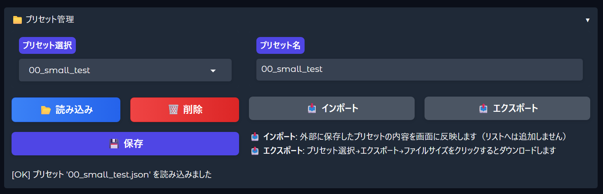
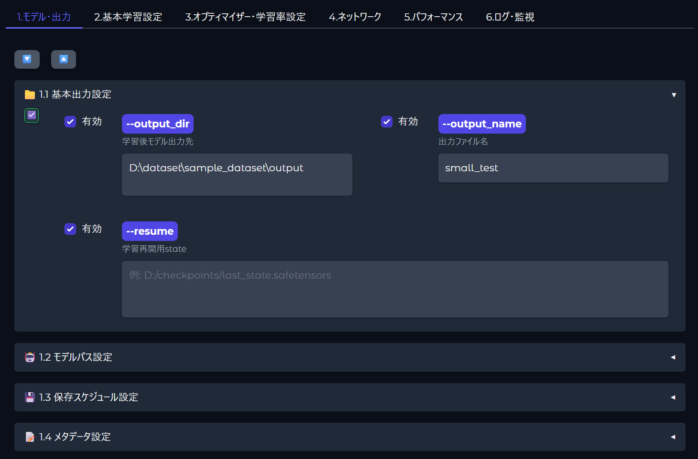
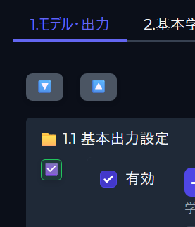
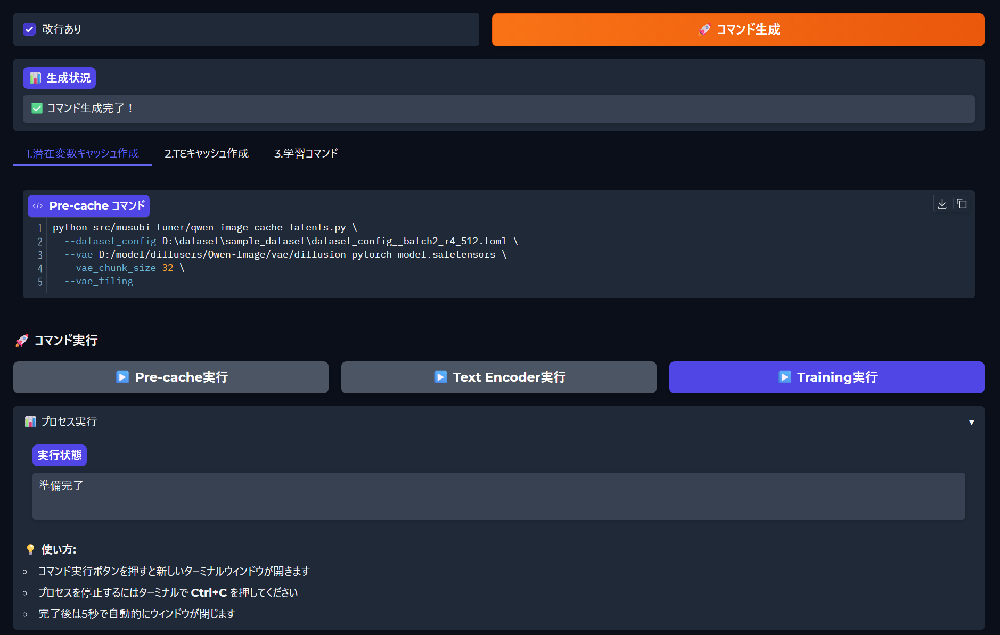
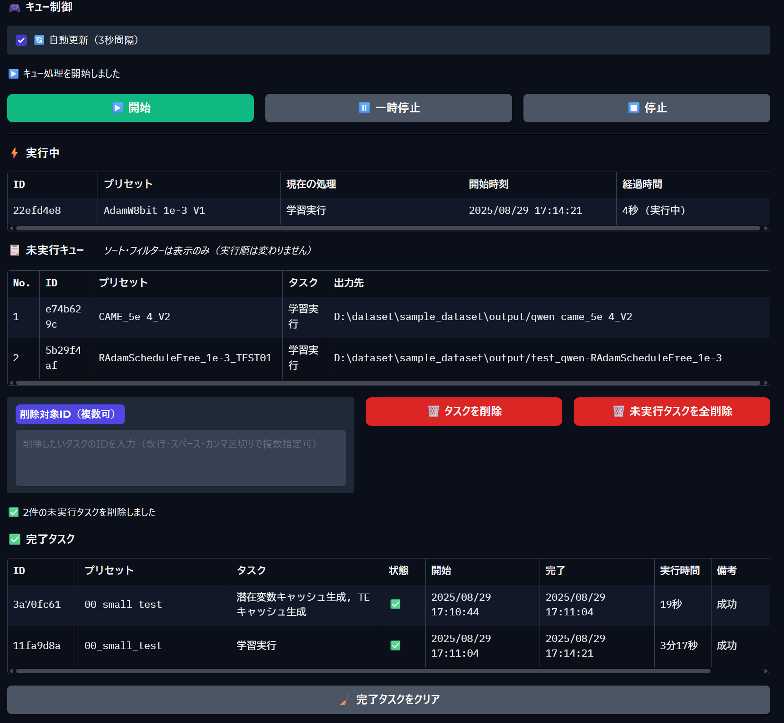
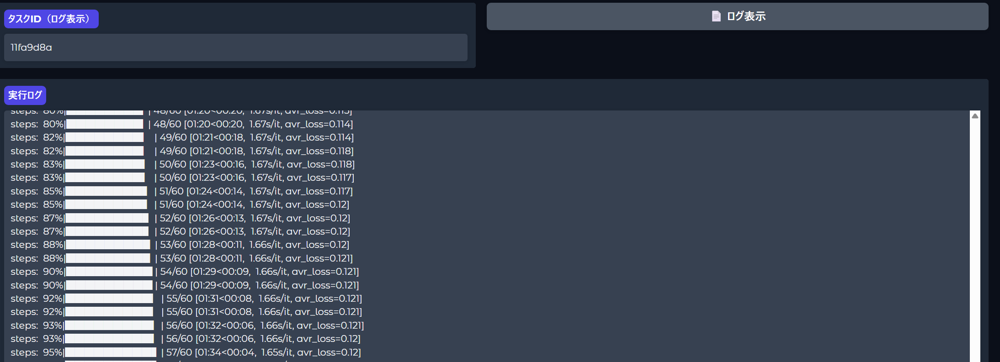
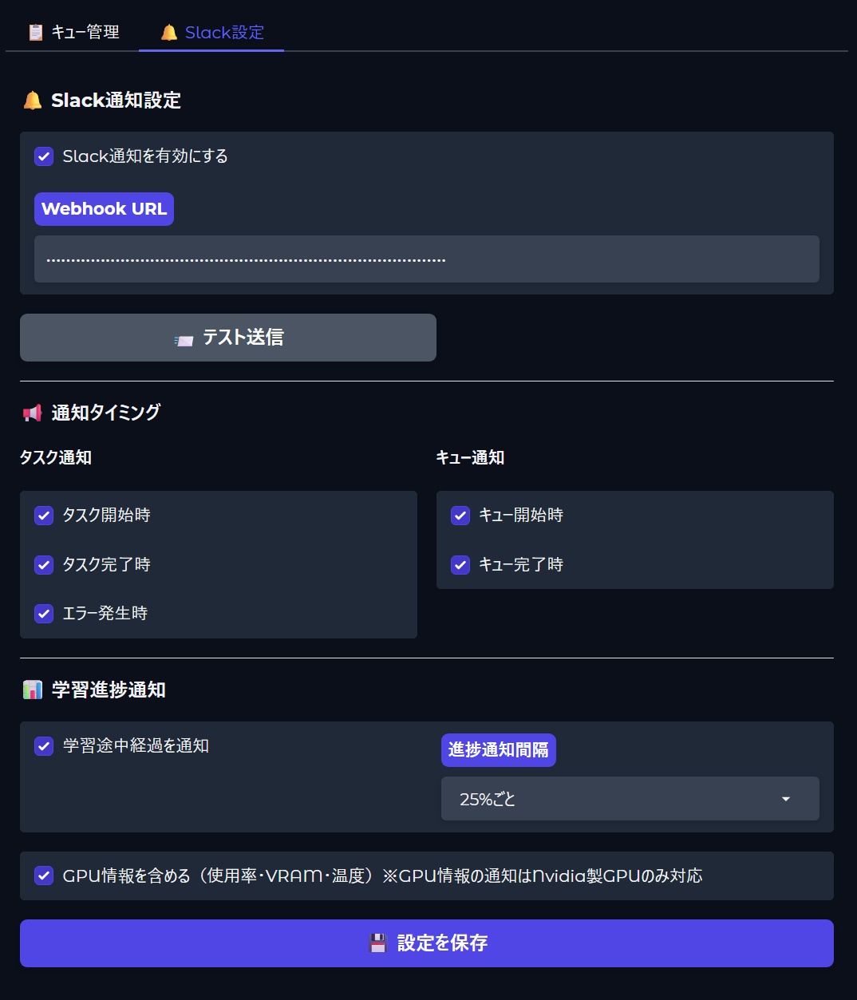

# QWEN LoRA GUI & Queue System

QWEN-ImageモデルのLoRA学習専用のコマンド生成GUIツール。コマンド生成から実行管理まで、学習ワークフロー全体を効率化します。
#### Musubi-tunerの導入が別途必要です。

## ✨ 主要機能

## 変更履歴
2025/08/31
- Linux対応(WSL2で動作確認）
- 起動時設定可能引数に --host追加

### 🎨 QWEN LoRA GUI (コマンド作成機能)
- **プリセット管理**: 設定の保存・読み込み・インポート/エクスポート
- **動的オプティマイザー設定**: テンプレート記述でオプティマイザーを柔軟に追加可能
- **リアルタイムコマンド生成**: パラメータ変更を即座に反映
- **バリデーション機能**: ファイル存在確認とエラー表示

### 🚀 QUEUE SYSTEM (キューシステム)
- **タスクキュー管理**: 複数の学習タスクを順次実行
- **進捗モニタリング**: リアルタイムログ表示とGPU使用状況
- **Slack通知**: タスク完了・エラー時の自動通知
- **柔軟なスケジューリング**: プリキャッシュ→テキストエンコーダー→学習の自動実行

## 📁 推奨ディレクトリ構成

musubi-tunerと連携して使用する場合の推奨構成:
```
workspace/
│ 
├── musubi-tuner/              # CLI実行環境
│   └── src/
│       └── musubi_tuner/       # CLIスクリプト群
│           ├── qwen_image_cache_latents.py
│           ├── qwen_image_cache_text_encoder_outputs.py
│           └── qwen_image_train_network.py
│
└── qwen-lora-gui/             # GUI & キューシステム
    ├── apps/                  # アプリケーションモジュール
    │   ├── gui/              # GUIコンポーネント
    │   └── queue/            # キューシステム
    ├── core/                  # 共通コアモジュール
    ├── data/                  # データ・設定・ログ
    │   ├── config/           # 設定ファイル
    │   ├── presets/          # プリセット保存
    │   ├── logs/             # 実行ログ
    │   └── queue_system/     # キューシステムログ
    ├── docs/                  # ドキュメント
    ├── launch_gui.py         # GUI起動スクリプト
    ├── launch_queue.py       # キューシステム起動スクリプト
    └── requirements.txt      # 依存パッケージ
```

## 🛠️ セットアップ

### 1. リポジトリのクローン

```bash
git clone https://github.com/am7coffee/qwen-lora-gui.git
cd qwen-lora-gui
```

### 2. Python仮想環境の作成 (Windows)

```bash
# 仮想環境の作成
python -m venv venv

# 仮想環境の有効化
venv\Scripts\activate

# 依存パッケージのインストール
pip install -r requirements.txt
```

### 3. CLI設定の更新
推奨以外のパスに配置する場合設定が必要です
`data/config/cli_settings.json`を編集して、musubi-tunerのパスを設定:

```json
{
    "cli_root_path": "../musubi-tuner",
    "cli_venv_path": "../musubi-tuner/venv"
}
```

## 🚀 使用方法

### QWEN LoRA GUI (コマンド作成)

```bash
# 基本起動
python launch_gui.py

# ポート指定
python launch_gui.py --port 8080

# ブラウザ自動起動なし
python launch_gui.py --no-browser
```

> **💡 推奨設定**  
> より見やすい表示のため、ブラウザでダークモードの利用を推奨します：  
> `http://127.0.0.1:7860/?__theme=dark`

#### 🎯 プリセット管理機能



- **プリセット保存・読み込み**: 複雑な設定を名前付きで保存・再利用
- **インポート・エクスポート**: JSONファイルでの設定共有
- **設定履歴管理**: 過去の設定を簡単に復元

#### 📊 6つの設定パネル



GUIは論理的に分類された6つのタブで構成：

1. **モデル・出力** - モデルパス、出力設定、メタデータ
2. **基本学習設定** - エポック数、勾配設定、最適化パラメータ  
3. **オプティマイザー・学習率設定** - 最適化手法、学習率スケジューラー
4. **ネットワーク** - LoRA設定、タイムステップ設定
5. **パフォーマンス** - 高速化オプション、精度設定、分散処理
6. **ログ・監視** - ログ出力、サンプリング、外部サービス連携

> 📋 各パラメータの詳細については [引数一覧](docs/引数一覧.md) を参照してください

#### 🔧 アコーディオンUI



- **一括開閉ボタン** (🔽🔼): 全セクションの表示/非表示を制御
- **セクション別トグル**: 必要な設定のみを表示して作業効率を向上

#### ⚡ リアルタイムコマンド生成・実行



- **改行設定**: 生成するコマンドを改行あり/なしで任意に指定可能
- **即座にコマンド生成**: パラメータ変更を即座にCLIコマンドに反映
- **バリデーション機能**: ファイル存在確認とエラーハイライト
- **ターミナル実行**: 生成されたコマンドを新規ターミナルで実行

### QUEUE SYSTEM (キューシステム)

```bash
# 基本起動
python launch_queue.py

# ポート指定
python launch_queue.py --port 7861

# デバッグモード
python launch_queue.py --debug
```

#### 📝 タスクキュー管理

**プリセットからキュー追加**

.png)

- **プリセット選択**: GUI で作成したプリセットを選択してキューに追加
- **実行順序指定**: プリキャッシュ → テキストエンコーダー → 学習の順序を自動設定
- **柔軟な設定**: 各ステップの有効/無効を個別に制御

**JSONファイルからインポート**

.png)

- **バッチ追加**: 複数のプリセットJSONファイルを一括インポート
- **設定継承**: GUI で作成したプリセットをそのまま活用
- **効率的な運用**: 事前に準備したプリセット群を素早くキューに追加

#### 🎯 タスク実行管理



- **リアルタイム進捗**: 実行中タスクの進捗状況をリアルタイム表示
- **キュー操作**: タスクの一時停止、再開、削除を柔軟に制御
- **実行統計**: 成功/失敗数、実行時間、完了率を一目で把握
- **自動実行**: キューに追加されたタスクを順次自動実行

#### 📊 ログ・モニタリング機能



- **ログ表示**: コンソールログをID指定で確認できます。
- **ログ保存**: 全実行ログをファイルとして保存・管理

#### 📱 Slack通知機能



- **完了通知**: タスク完了時にSlackへ自動通知
- **進捗報告**: 学習進捗（25%, 50%, 75%, 100%）の定期報告
- **エラー通知**: 実行エラー時の即座な通知
- **GPU情報**: GPU使用状況を簡易レポート(Nvidia製GPUのみ)
- **柔軟な設定**: 通知の種類・間隔を細かく制御可能

> **💡 Slack Webhook URL の取得方法**  
> Slack通知を利用するには、Incoming Webhook URLが必要です。詳細な取得手順は [こちらのガイド](docs/slack_incoming%20webhook%20URL取得説明.md) を参照してください。

## 📝 Windows用起動バッチファイル

### GUI起動用 (`start_gui.bat`)

```batch
@echo off
cd /d D:\workspace\qwen-lora-gui
call venv\Scripts\activate
python launch_gui.py
pause
```

### キューシステム起動用 (`start_queue.bat`)

```batch
@echo off
cd /d D:\workspace\qwen-lora-gui
call venv\Scripts\activate
python launch_queue.py
pause
```

### 統合起動用 (`start_all.bat`)

```batch
@echo off
cd /d D:\workspace\qwen-lora-gui
call venv\Scripts\activate

echo Starting QWEN LoRA GUI...
start "QWEN LoRA GUI" cmd /k python launch_gui.py

timeout /t 3 /nobreak > nul

echo Starting Queue System...
start "Queue System" cmd /k python launch_queue.py

echo.
echo Both systems are starting...
echo GUI: http://127.0.0.1:7860
echo Queue: http://127.0.0.1:7861
pause
```

##TIPS

#### 1. オプティマイザーライブラリのインストール

学習するMusubi-tuner側の仮想環境をアクティベートした状態で、使用したいオプティマイザーに応じて以下のコマンドを実行します。

| オプティマイザー | インストールコマンド | 備考 |
|---|---|---|
| **Prodigy** | `pip install prodigyopt` | 適応的学習率を自動調整するオプティマイザー |
| **CAME** | `pip install pytorch-optimizer` | CAMEは`pytorch-optimizer`ライブラリに含まれています |
| **RAdamScheduleFree** | `pip install schedulefree` | スケジューラー不要のオプティマイザー |

**全て一括でインストールする場合:**

```bash
pip install prodigyopt pytorch-optimizer schedulefree
```

## 🔧 開発者向け

### コード品質チェック

```bash
# Ruffでフォーマット
venv\Scripts\ruff format apps/ core/

# Ruffでリント
venv\Scripts\ruff check apps/ core/ --fix

# MyPyで型チェック
venv\Scripts\mypy apps/ core/ --ignore-missing-imports
```

### プロジェクト構造

```
apps/
├── gui/              # GUIアプリケーション
│   └── components/   # UIコンポーネント群
└── queue/           # キューシステム
    └── components/  
        ├── core/    # コア実行ロジック
        └── ui/      # UI実装

core/                # 共通モジュール
├── commands/        # コマンド生成
├── config/         # 設定管理
├── presets/        # プリセット管理
└── validation/     # バリデーション
```

## 📋 システム要件

- Python 3.10以上
- Windows 10/11 (推奨) ※Linuxではコマンド実行とキューシステム動作しません
- NVIDIA GPU (CUDA対応) ※SlackでGPUのステータス通知はNvidia製のみ可能
- 8GB以上のRAM

## 📄 ライセンス

[MIT License](LICENSE)

## 📞 サポート

問題が発生した場合は、[Issues](https://github.com/am7coffee/qwen-lora-gui/issues)でお知らせください。

---

**注意**: このツールは`musubi-tuner`と連携して動作します。CLIツールのセットアップについては、musubi-tunerのドキュメントを参照してください。
#### Musubi-tunerの導入が別途必要です。